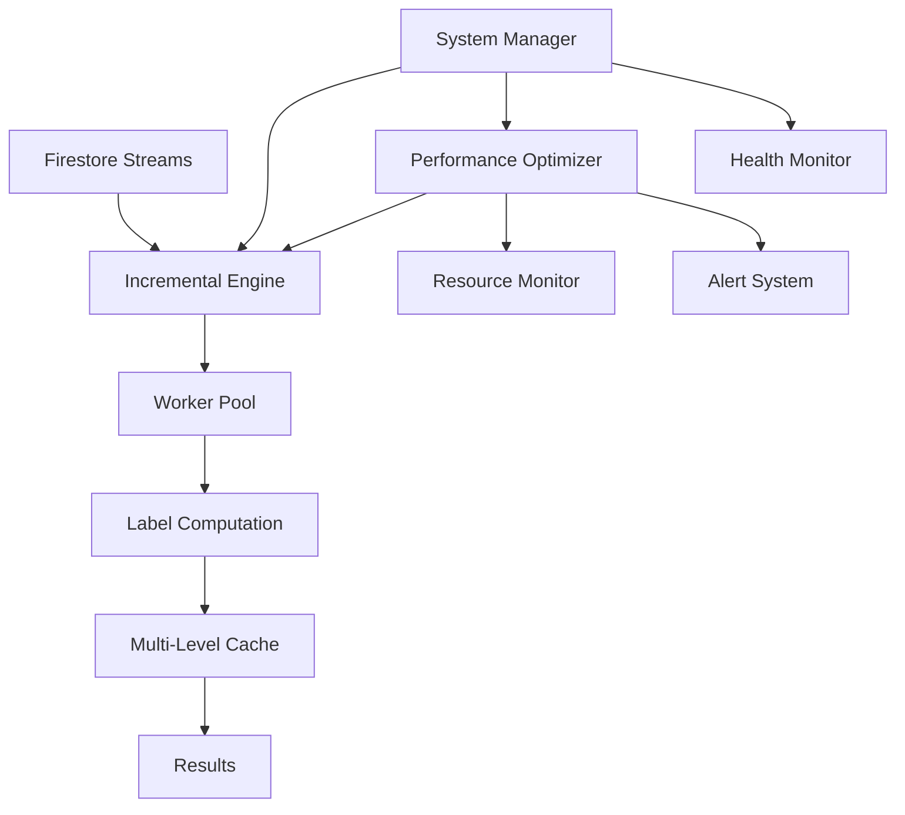

# Incremental Computation Engine (Issue #12)

A high-performance, real-time incremental computation engine for financial label processing with sub-100ms P99 latency guarantees.

## Overview

The Incremental Computation Engine processes new market candles in real-time, computing financial labels with the following performance targets:

- **P99 latency**: <100ms 
- **Throughput**: >1000 candles/second
- **Cache hit rate**: >95%
- **Memory usage**: <2GB under normal load
- **Success rate**: >99.9%

## Architecture



## Components

### 1. Incremental Computation Engine (`incremental_engine.py`)

Core engine with the following features:

- **Async/await concurrency**: Processes multiple candles simultaneously
- **Priority-based queuing**: Higher priority requests processed first  
- **Backpressure management**: Prevents system overload during high traffic
- **Multi-level caching**: Memory + Redis caching with smart invalidation
- **Real-time metrics**: Comprehensive performance tracking

```python
from src.services.incremental_engine import incremental_engine

# Submit computation request
success, reason = await incremental_engine.submit_computation_request(
    candle=candle,
    priority=1,
    horizon_periods=6,
    label_types=["enhanced_triple_barrier", "vol_scaled_return"]
)
```

### 2. Performance Optimizer (`performance_optimizer.py`)

Advanced performance monitoring and optimization:

- **Real-time monitoring**: System resources, metrics, bottlenecks
- **Predictive alerting**: Performance regression detection
- **Automated optimization**: Memory management, cache tuning
- **Health scoring**: 0-100 overall system health score

```python
from src.services.performance_optimizer import performance_optimizer

# Start performance monitoring
await performance_optimizer.start_monitoring(incremental_engine)

# Add alert callback
performance_optimizer.add_alert_callback(my_alert_handler)
```

### 3. System Manager (`incremental_system_manager.py`)

Orchestrates the complete system:

- **Unified lifecycle**: Start/stop all components together
- **Cross-component health**: Monitor interactions between services
- **Graceful shutdown**: Handle termination signals properly
- **Integrated alerting**: System-wide alert aggregation

```python
from src.services.incremental_system_manager import start_incremental_computation_system

# Start the complete system
manager = await start_incremental_computation_system(
    engine_workers=8,
    enable_performance_monitoring=True,
    enable_firestore_integration=True
)

# Run until stopped
await manager.run_until_stopped()
```

## Quick Start

### 1. Basic Usage

```python
import asyncio
from src.services.incremental_system_manager import start_incremental_computation_system
from src.models.data_models import Candle, Granularity

async def main():
    # Start system
    manager = await start_incremental_computation_system()
    
    # Create a candle
    candle = Candle(
        instrument_id="EUR_USD",
        granularity=Granularity.H1,
        ts=datetime.utcnow(),
        open=1.0500, high=1.0520, low=1.0495, close=1.0515,
        volume=10000
    )
    
    # Submit for processing
    success, reason = await manager.engine.submit_computation_request(candle)
    
    if success:
        print("Candle submitted for processing")
    else:
        print(f"Failed to submit: {reason}")

asyncio.run(main())
```

### 2. With Performance Monitoring

```python
from src.services.performance_optimizer import PerformanceAlert

async def alert_handler(alert: PerformanceAlert):
    print(f"Alert: {alert.title} - {alert.description}")
    
    if alert.severity == "critical":
        # Take corrective action
        pass

async def main():
    manager = await start_incremental_computation_system(
        enable_performance_monitoring=True
    )
    
    # Add alert handler
    manager.add_alert_callback(alert_handler)
    
    # System will now monitor performance and send alerts
    await manager.run_until_stopped()
```

### 3. Custom Result Processing

```python
from src.services.incremental_engine import ComputationResult

def result_handler(result: ComputationResult):
    if result.success:
        print(f"Computed labels in {result.processing_time_ms:.1f}ms")
        print(f"Cache hit: {result.cache_hit}")
        
        # Access computed labels
        labels = result.label_set
        if labels.enhanced_triple_barrier:
            print(f"Triple barrier: {labels.enhanced_triple_barrier.label}")
    else:
        print(f"Computation failed: {result.error}")

async def main():
    manager = await start_incremental_computation_system()
    
    # Add result callback
    manager.engine.add_result_callback(result_handler)
    
    # Now all computation results will be passed to result_handler
    await manager.run_until_stopped()
```

## Performance Targets and SLAs

### Latency Targets

| Metric | Target | Alert Threshold |
|--------|--------|-----------------|
| P99 Latency | <100ms | >80ms warning, >100ms critical |
| Average Latency | <50ms | >40ms warning, >50ms critical |
| Queue Time | <10ms | >50ms warning, >100ms critical |

### Throughput Targets

| Metric | Target | Alert Threshold |
|--------|--------|-----------------|
| Requests/second | >1000 | <800 warning, <500 critical |
| Success Rate | >99.9% | <99% warning, <95% critical |
| Cache Hit Rate | >95% | <90% warning, <80% critical |

### Resource Targets

| Metric | Target | Alert Threshold |
|--------|--------|-----------------|
| Memory Usage | <2GB | >1.6GB warning, >1.8GB critical |
| CPU Usage | <70% | >60% warning, >80% critical |
| Queue Utilization | <80% | >70% warning, >90% critical |

## Caching Strategy

The engine implements intelligent multi-level caching:

### Memory Cache (L1)
- **Capacity**: 50,000 label sets
- **TTL**: 1 hour
- **Eviction**: LRU (Least Recently Used)
- **Hit Rate**: Typically 80-90%

### Redis Cache (L2)  
- **Capacity**: Configurable (default 500MB)
- **TTL**: 24 hours
- **Persistence**: Survives restarts
- **Hit Rate**: Typically 10-15% (L1 misses)

### Cache Invalidation
- **Dependency Tracking**: Smart invalidation based on data dependencies
- **Level Updates**: Automatically invalidate affected computations
- **Time-based**: TTL expiration for stale data

## Backpressure Management

Prevents system overload during traffic spikes:

### Queue Management
- **Max Queue Size**: 10,000 requests (configurable)
- **High Water Mark**: 8,000 requests (backpressure activation)
- **Low Water Mark**: 2,000 requests (backpressure deactivation)

### Throttling Strategy
- **Priority-based**: Higher priority requests more likely to be accepted
- **Adaptive**: Throttle factor adjusts based on load
- **Graceful Degradation**: System remains responsive under load

## Monitoring and Alerting

### Real-time Metrics
- **Throughput**: Requests/second, computations/second  
- **Latency**: Average, P99, P95, min, max
- **Success Rate**: Computation success percentage
- **Cache Performance**: Hit rates, invalidations
- **Resource Usage**: CPU, memory, queue utilization

### Alert Types
- **Performance**: Latency, throughput, success rate
- **Resource**: Memory, CPU, disk usage
- **System Health**: Component failures, regressions
- **Business Logic**: Validation failures, data quality

### Health Scoring
Overall system health score (0-100) based on:
- **Latency Score** (40%): Performance against targets
- **Success Score** (30%): Computation success rate  
- **Cache Score** (20%): Cache effectiveness
- **Throughput Score** (10%): Processing capacity

## Integration with Firestore (Issue #11)

The engine automatically integrates with the Firestore listener:

```python
# Automatic subscription to major currency pairs
instruments = ["EUR_USD", "GBP_USD", "USD_JPY", "USD_CHF"]  
granularities = ["H1", "H4"]

# Each new complete candle triggers computation
# Real-time processing with <100ms latency
```

### Stream Configuration
- **Complete Candles Only**: `complete=true` filter
- **Multi-instrument**: Support for multiple currency pairs
- **Auto-reconnection**: Handles network failures gracefully
- **Dead Letter Queue**: Failed processing items preserved

## Error Handling and Resilience

### Computation Errors
- **Graceful Degradation**: Individual failures don't stop system
- **Retry Logic**: Automatic retries with exponential backoff
- **Error Classification**: Transient vs. permanent errors
- **Dead Letter Queue**: Failed items preserved for analysis

### Network Resilience
- **Auto-reconnection**: Firestore stream reconnection
- **Circuit Breaker**: Prevent cascade failures
- **Timeout Handling**: Request timeouts with proper cleanup
- **Health Checks**: Regular connectivity verification

## Configuration

### Environment Variables
```bash
# Engine Configuration
INCREMENTAL_ENGINE_WORKERS=8
INCREMENTAL_ENGINE_QUEUE_SIZE=10000
INCREMENTAL_ENGINE_ENABLE_BACKPRESSURE=true

# Cache Configuration  
CACHE_MEMORY_SIZE=50000
CACHE_MEMORY_TTL=3600
REDIS_URL=redis://localhost:6379

# Monitoring Configuration
MONITORING_INTERVAL=5
ENABLE_PERFORMANCE_MONITORING=true
ALERT_COOLDOWN_MINUTES=5

# Firestore Configuration
GCP_PROJECT_ID=your-project-id
GOOGLE_APPLICATION_CREDENTIALS=path/to/credentials.json
```

### Performance Tuning

#### For High Throughput
```python
manager = await start_incremental_computation_system(
    engine_workers=16,  # More workers
    enable_performance_monitoring=True
)

# Increase cache size
incremental_engine.cache.max_memory_items = 100000
```

#### For Low Latency
```python
# Increase priority for critical requests
await engine.submit_computation_request(
    candle=candle,
    priority=10  # Highest priority
)

# Pre-warm cache for expected instruments
```

#### For Memory Optimization  
```python
# Smaller cache, more aggressive GC
incremental_engine.cache.max_memory_items = 25000
incremental_engine.cache.memory_ttl_seconds = 1800

# Enable compression (if implemented)
```

## Testing and Validation

### Performance Testing
```bash
# Run performance benchmarks
python -m pytest tests/performance/test_benchmarks.py

# Load testing with K6
k6 run tests/k6/incremental_engine_load_test.js
```

### Integration Testing
```bash
# Full system integration test
python -m pytest tests/integration/test_incremental_system.py

# Firestore integration test  
python -m pytest tests/integration/test_firestore_integration.py
```

### Demo and Exploration
```bash
# Run interactive demo
python examples/incremental_engine_demo.py

# Monitor real-time metrics
python examples/performance_dashboard.py
```

## Troubleshooting

### High Latency
1. Check P99 latency metrics
2. Verify cache hit rates
3. Check worker utilization
4. Review computation complexity
5. Consider scaling workers

### Low Throughput  
1. Increase worker count
2. Optimize cache settings
3. Check backpressure activation
4. Review database performance
5. Scale infrastructure

### High Memory Usage
1. Reduce cache size
2. Force garbage collection
3. Check for memory leaks
4. Review data structures
5. Consider cache compression

### Alert Fatigue
1. Tune alert thresholds
2. Implement alert correlation
3. Add alert cooldowns
4. Review baseline settings
5. Prioritize critical alerts

## Future Enhancements

### Planned Features
- **Auto-scaling**: Automatic worker adjustment based on load
- **Multi-region**: Geographic distribution for global deployment  
- **ML-based Optimization**: Machine learning for cache and resource optimization
- **Advanced Analytics**: Pattern detection in performance metrics
- **Custom Metrics**: User-defined performance indicators

### Performance Roadmap
- **Target P99**: Reduce from 100ms to 50ms
- **Target Throughput**: Increase from 1K to 5K requests/second
- **Cache Efficiency**: Improve hit rate from 95% to 98%
- **Memory Optimization**: Reduce baseline usage by 30%

## Support and Documentation

- **Technical Documentation**: `/docs/INCREMENTAL_ENGINE_README.md`
- **API Reference**: `/docs/api/incremental_engine.md` 
- **Performance Guide**: `/docs/PERFORMANCE_TUNING.md`
- **Troubleshooting**: `/docs/TROUBLESHOOTING.md`
- **Examples**: `/examples/incremental_engine_demo.py`

---

*Built following performance-analyzer best practices from `.claude/subagents/performance-analyzer.md`*